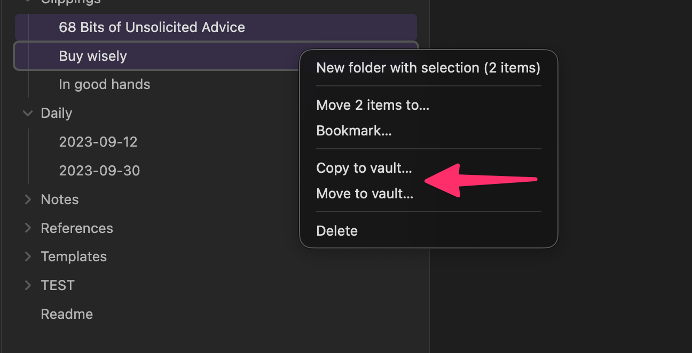
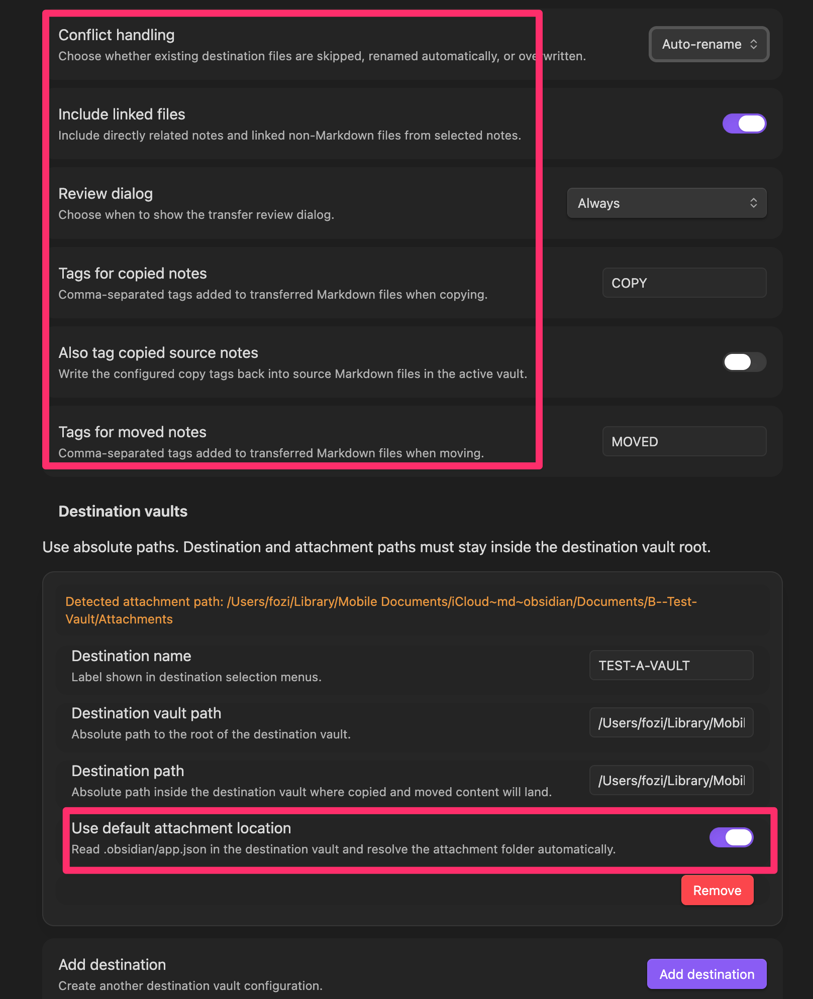
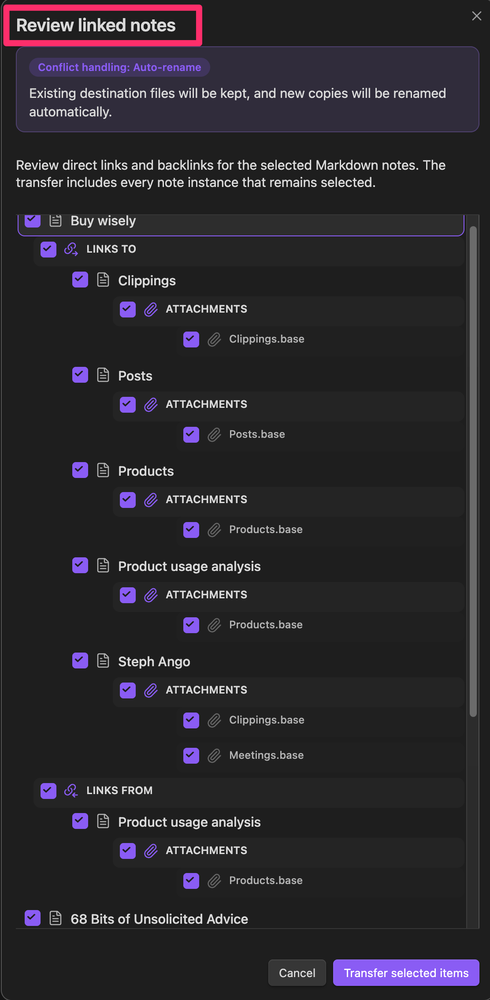

 

# Trans Vault

Trans Vault is an Obsidian desktop plugin for copying and moving files, multiple files, and folders from the active vault into other local Obsidian vaults.

## Features

- Copy and move from the active vault into configurable local destination vaults.
- Supports single files, multi-selection in the file explorer, and folders.
- Preserves internal folder structure for selected folders.
- Transfers selected standalone files flat into the configured destination path.
- Optional Notebook Navigator context menu integration when that plugin exposes its menu API.
- Direct note review dialog for explicitly selected markdown files.
- Displays direct `links to` and direct `links from` relationships in an Obsidian-style tree.
- Independent checkbox state for the same note under different branches.
- Rewrites wiki links and standard markdown links when both ends are transferred.
- Supports conflict handling with `skip`, `auto-rename`, and `overwrite`.
- Writes copy and move tags into YAML frontmatter instead of appending tags to the body.
- Can optionally tag copied source notes in the active vault.

## Commands and Menus

- Command palette:
	- `Copy active file to vault...`
	- `Move active file to vault...`
- File explorer context menus:
	- single file
	- multi-selection
	- folders
- Context menu actions open a destination chooser modal before the transfer starts.
- Notebook Navigator context menus are added when the external plugin exposes a compatible menu registration API.

## Destination Configuration

Each destination configuration contains:

- Destination name
- Destination vault path
- Destination path
- Use destination default attachment location
- Attachment path

Rules:

- All configured paths must be absolute.
- Destination path and attachment path must remain inside the configured destination vault root.
- When automatic attachment detection is enabled, Trans Vault reads `.obsidian/app.json` in the destination vault and resolves `attachmentFolderPath` against the destination vault root.
- If the destination vault does not expose a readable attachment setting, the destination vault root is used as the fallback attachment location.

## Transfer Behavior

- Copy and move are both supported.
- Move only deletes source files after the destination write has completed successfully.
- Explicitly selected folders keep their internal structure below the destination path.
- Explicitly selected standalone files are transferred flat into the destination path.
- Directly linked non-markdown files are written to the attachment path.
- When `Include linked files` is enabled, direct non-markdown dependencies of selected markdown notes are included automatically.

## Review Dialog

The review dialog behavior is controlled by `Review dialog`:

- `Always` shows the dialog whenever explicitly selected markdown files are part of the transfer.
- `Only when notes are linked` shows the dialog only when at least one explicitly selected markdown file has a direct markdown link or direct markdown backlink.
- `Never` skips the dialog entirely.

The dialog shows one root node per explicitly selected markdown file and optional group nodes below it:

- `links to` with a right arrow icon
- `links from` with a left arrow icon

The active conflict handling setting is shown prominently at the top of the review dialog so the applied strategy is visible before confirmation.

Behavior:

- All nodes start enabled.
- Parent nodes show a mixed state when only part of a subtree remains selected.
- The same note can appear multiple times and each visible instance can be toggled independently.
- The final markdown transfer set is the union of all active visible note instances by file path.

## Conflict Handling

Trans Vault supports three conflict strategies:

- `skip`: existing targets are skipped.
- `auto-rename`: creates `Name 1.ext`, `Name 2.ext`, and so on.
- `overwrite`: replaces existing destination files.

If skipped conflicts occur, the plugin shows a persistent Obsidian notice with:

- a warning summary
- up to 10 skipped elements listed line by line
- a final `... and N more skipped elements.` line when needed

Without skipped conflicts, the summary notice is temporary.

## Tagging via Frontmatter

Global tag settings:

- `Tags for copied notes`
- `Also tag copied source notes`
- `Tags for moved notes`

Tag rules:

- Input is comma-separated.
- Tags may be entered with or without a leading `#`.
- Empty tag fields leave markdown files unchanged.
- Only markdown files are tagged.
- Existing frontmatter tags are merged without duplicates.
- Existing formats are preserved where possible:
	- arrays stay arrays
	- strings stay strings
	- comma-separated strings stay comma-separated
	- whitespace-separated strings stay whitespace-separated
- New frontmatter uses a single string for one tag and an array for multiple tags.
- Invalid frontmatter never aborts the transfer. Tagging is skipped for that file and the transfer continues.

## Disclosures

- This plugin accesses files outside the active Obsidian vault. It needs that access to copy or move notes, folders, and linked files into other local destination vaults that you configure explicitly.
- This plugin does not use the network.
- This plugin does not require an account.
- This plugin does not require payment for full functionality.
- This plugin does not include telemetry.
- This plugin does not show ads.

## Limitations

- Desktop only. Mobile is not supported.
- External destination vaults are handled through direct local file system access.
- The review dialog only displays direct markdown relationships for explicitly selected markdown files.
- Link rewriting only applies to markdown files and only when the referenced destination file is also transferred.
- There is no telemetry and no network access.

## License

MIT
